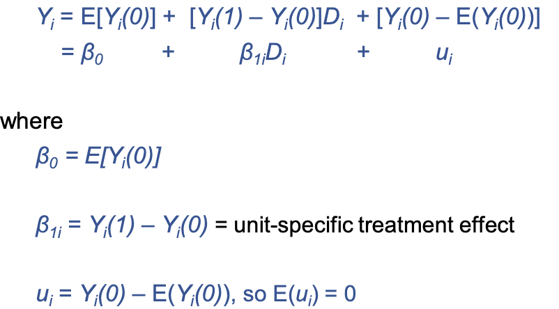

## Causal Relationships and Treatments

-   **causality** - an action ($D$) causes a change in outcome Y, if this change is the direct result of $D$
    -   **causal effect** - something has happened, or is happening, based on something that has occurred or is occurring
    -   alternatively, **B happened because of A, and the outcome of B is strong or weak depending how much of or how well A worked**
-   **treatments** are applied to a unit at a given point in time
    -   **unit** can be a person, location, firm, classroom, market, etc.
        -   a single unit is selected from the population, and is selected to be treated or NOT treated
    -   based on this definitoin, the same person/location at a different point in time, is a different **unit**
    -   Examples
        -   implementing MPAs
        -   attending college
        -   exposure to air pollution
    -   treatments can be binary
-   Note

### Unit-level Treatment Effect

-   Mathematically: ${\beta_1}_i = Y_i(0) - Y_i(1)$
    -   the causal effect of the treatment of $D_i$ for unit $i$
    -   index ($i$) denotes that treatments can have different effects on different units/individuals
-   important notes about ${\beta_1}_i$
    -   we do not observe multiple treatments on a single unit
-   Note

### Fundamental Problem of Causal Inference

-   **counterfactual** - hypothetical unobserved value
    -   in other words, outcome if the unit got the alternative treatment
    -   this class is about the validity of the counterfactual that we choose
-   note

## SUTVA and Observed Outcomes

-   **stable-unit treatment value assumption (SUTVA)**
    -   no interference
        -   the outcome for unit $i$ depends solely on it's own treatment
        -   unrelated to treatment of other units, time, etc.
    -   homogeneous treatment
        -   a unit can only receive one type of treatment
-   observed outcomes mathematically:
    -   formula [VIEW SLIDE 9/19]
-   SUTVA is a more restrictive set of assumptions
    -   rules out interference, spillovers, equilibrium effects, peer effects, etc.

## ATE and ATT

-   ATE and ATT are the most common causal parameters of interest
-   Average treatment effect (ATE)
    -   formula: $ATE = E[ Y_i(1) - Y_i(0)]$

    -   expected effect of the treatment for a randomly chosen unit
-   Average treatment effect on the treated (ATT)
    -   formula: $ATT = E[Y_i(1) - Y_i(0) | D_i = 1]$
    -   expected treatment effect for units who received the treatment
-   **Example**
    -   data:

        | i   | Yi(1) | Yi(0) | B1i | Di  | Yi  |
        |-----|-------|-------|-----|-----|-----|
        | 1   | 5     | 2\*   | 3\* | 1   | 5   |
        | 2   | 1     | 1\*   | 0\* | 1   | 1   |
        | 3   | 1\*   | 0     | 1\* | 0   | 0   |
        | 4   | 1\*   | 1     | 0\* | 0   | 1   |

        -   \*indicates unobserved

    -   ATT = (2+3)/2 = 2.5

    -   ATE = (3+0+1+1)/4 = 1
-   requirements for identification

## Connect Potential Outcomes & Regression

-   the $ATE$ model can be re-written to be equivalent to a linear regression equation

    {width="410"}

-   you can't use a simple regression to calculate ${\beta_1}_i$

    -   not sure what this means

-   note

### Identification of ATE with OLS Regression

-   recall unbiasdness from OLS
    -   taking the mean of multiple unbiased estimated should reveal an estimate that's close to the true population parameter
-   applying regression to apply ATE can only be done if there is no correlation
    -   mathematically $cov(D_i, u_u) = 0)$, meaning $u$ and $D$ are uncorrelated
-   note

## Treatment Assignment Methods

1.  randomly assign treatment
2.  Treatment not independent of potential outcomes, selection into $D = (0,1)$ based only on *observable* variables
3.  Treatment not independent of potential outcomes, selection into $D = (0,1)$ based only on *unobservable* variables
