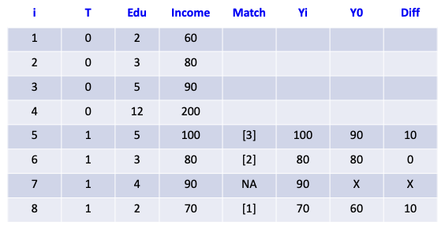
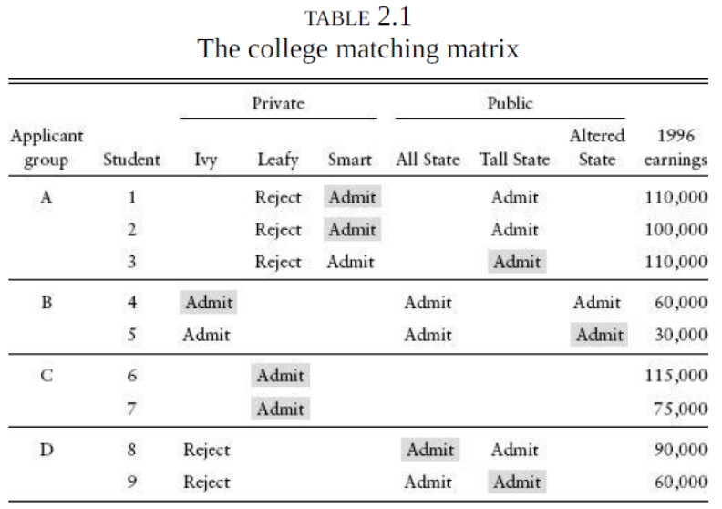

## Estimating ATE and ATT 

-   when exact matching occurs
    -   recall: matching table

        

    -   there is ONE exact match for 5 years

    -   there is NO exact match for 4 years, so there is no counter factual

    -   if there are MULTIPLE matches for a year, the incomes would be averaged
-   ATT - average treatment affect on the treated
    -   only one counter factual, which is what the result would be if they were treated
-   goal is to create credible counter factuals, and get comparable units
-   Solutions for handling to handle small data
    -   **nearest neighbor** - choosing a neighbor with a close enough match to indicate a potential value
    -   remove data without a match
        -   can end up removing too much data
    -   propensity score matching
-   Note

## Case Study: Matching Estimator

-   **Question**: what's the economic return of going to a very selective college?

-   **Assessing bias**: on average, students w/higher preparation are more likely to attend more selective college

    -   the regression estimate of the wages might reflect differences in family background and unobserved individual ability
    -   instead of looking at students who attended selective colleges, we can look at admissions
        -   decreases some of the bias discussed above

-   Data

    

    -   treatment ignorability assumption = application set and admittance set, college selectivity randomly assigned across students

-   Results

    [INSERT RESULTS TABLE]

    -   "private" is intended to mean more selective
    -   these indivator variables are equivalent to the high-dimensional exact matching regression estimator

-   Note

## Propensity Score

-   Problem the propensity score addresses
    -   we want to use a scalar/numeric measure of the variables that might matter for selection
        -   allows us to calculate average treatment effect on the outcome
-   **propensity score** $p(X_1)$ - the probability of receiving the treatment conditional on $X_i$
-   solves the high dimensionality issue of exact matching
    -   propensity score is scalar
-   propensity score and the ignorability condition
    -   the ignorability control on $X_i$ implies ignorability on the propensity score ($p(X_1)$).
-   example - estimating the propensity scores we estimate the probability that a fishery will be in an ITQ in a given year using four different specifications

## 3 Ways to Est Causal Effects Using the Propensity Score

### Blocking

-   blocking - matching the one propensity score
-   define $k$ blocks of the propensity score distribution
-   choose some number of blocks so that the propensity score is similar w/in blocks and the distribution of $X_i$ is balanced

### Reweighting estimator

-   aka inverse probability weighted estimator
    -   the inverse of the propensity score would be $1 - p(X_i)$
-   intuition behind IPW-estimator

### Re-weighting estimator

-   he said it's likely the approach we'd use since it's easy, and uses math we already know

-   estimates average treatment effect (ATE) using weighted OLS regression (WLS)

    ``` R
    lm(formula = Y ~ D + X1 ..., data = df, weights = wgt)
    ```

## Case Study: Propensity Scores

-   **Question**: can catch shares prevent fisheries collapse?
-   Study design
    -   treatment variable($D$)

        -   using pre-existing fshery data, identified 121 fisheries managed using catch shares

    -   outcome variable ( $Y$)

        -   outcome variable is a binary variable, fishery is collapsed or not
-   Note
