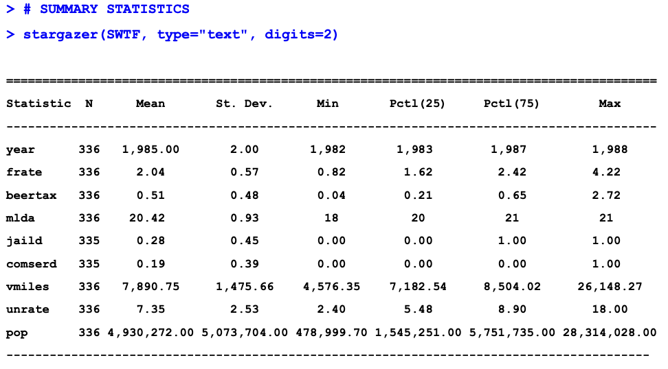

## Estimating Logit Propensity Scores in R

\*Additional notes and code in the `3.2-lecturePropScoreWithLogit.R` file

## Panel Data

-   aka longitudinal data
-   observe N cross-sectional units
    -   Example: "how a panel data file looks"

        | id  | year | female | age | educ | married | lnwafge |
        |-----|------|--------|-----|------|---------|---------|
        | 6   | 85   | No     | 25  | 16   | No      | 1.96    |
        | 6   | 86   | No     | 26  | 16   | No      | 2.06    |
        | 6   | 87   | No     | 27  | 16   | No      | 2.12    |
        | 6   | 88   | No     | 28  | 16   | No      | 2.18    |

        -   see slide for full table
        -   Interpretation: the ID column represents the individual. In this case we're looking at individual 6 over several years. From 1985-1988 we see this individuals wage increase, they have 16yrs of schooling and do not return to school during this time.
-   Benefits/use of panel data
    -   with panel data, we can control for factors that are unobserved or unmeasured
    -   if an omitted variable does NOT change over time, then any change in the outcome $Y$ over time cannot be caused by the omitted variable
    -   panel data allows us to resolve problems associated w/omitted variables bias caused by *time-invariant variables*
        -   breaking the link between time-invariant variables ($u$) and treatment ($D$)
-   Case study: DUI deaths
    -   Background

        -   40,000 traffic fatalities annually, 30% of fatal crashes involve a drunk driver, DUIs most likely to occur in the late evening/early night

    -   Possible state policy solutions

        -   lower the legal alcohol limit for dricing
        -   increase DUI penalties
        -   increase enforcement on drunk-driving laws
        -   increase price of alcohol through taxes

    -   **Question**: Does increasing the tax on beer reduce car accident fatalities?

    -   **Data**: summary statistics

        {width="903"}

    -   Cross-sectional regression

        -   **regression equation**: $Y_{it} = {\beta}_0 + {\beta}_1 D_{it} + u_{it}$
        -   $Y_{it}$ is the annual traffic fatality rate per 10,000 population in state $i$ and in year $t$
        -   $D_{it}$ is the beer tax in state $i$ and in year $t$

    -   **Discussion**: potential for OVB

        -   positive relationship between beer tax and traffic fatalities
        -   possibility for factors that are not controlled for such as quality of roads, state population, speed limits, etc.

    -   First-difference regression

        -   example of a fixed-effect-model
        -   new regression equation: $Y_{it} = {\beta}_0 + {\beta}_1 D_{it} + {\alpha}_i + u_{it}$
        -   ${\alpha}_i$ represents the time-invariant, unobserved factors that predict the fatality rate in state $i$
        -   the presence of ${\alpha}_i$ will cause omitted variable bias in the cross-sectional regression IF ${\alpha}_i$ is ***correlated*** with $D_{it}$
-   Note

## First Difference vs. Within Transformation Estimator

-   estimators are equivalent if T = 2
    -   differ when T\>2
-   without heteroskedasticity and serial correlation, the within estimator is more efficient
    -   more efficient = has lower standard
-   review the first difference estimator, and the within-transformation estimator
